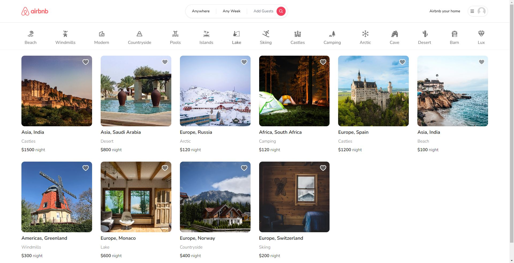

# Airbnb Clone

This project is an Airbnb clone built as a demonstration of full-stack web development. It utilizes various technologies such as Typescript, Zustand, MongoDB, Next.js, Tailwind CSS, and integrates with Google and GitHub for OAuth authentication. The project also incorporates the Leaflet library for selecting places on a map, allowing users to make reservations, create listings, share them with friends, and mark locations as favorites.

## Table of contents

- [Airbnb Clone](#airbnb-clone)
  - [Table of contents](#table-of-contents)
  - [Overview](#overview)
    - [The challenge](#the-challenge)
    - [Screenshot](#screenshot)
    - [Links](#links)
    - [Built with](#built-with)
    - [What I learned](#what-i-learned)
  - [Author](#author)
  - [Acknowledgments](#acknowledgments)

**Note: Delete this note and update the table of contents based on what sections you keep.**

## Overview

### The challenge

- Integration Complexity: Integrating multiple technologies and libraries, such as TypeScript, Zustand, MongoDB, Next.js, Tailwind CSS, Google and GitHub OAuth, and Leaflet, required careful coordination and understanding of each tool's documentation and APIs. Extensive research and referring to official documentation helped overcome integration challenges.
- OAuth Authentication: Implementing OAuth authentication with Google and GitHub involved understanding their respective APIs, configuring the application credentials, and handling the authentication flow. It required thorough testing and debugging to ensure a smooth and secure authentication process.
- State Management: Zustand, being a relatively new state management library, presented a learning curve and required understanding its concepts and usage patterns. Building a scalable and efficient state management system while keeping the codebase organized was a challenge that required careful planning and architecture design.
- Map Integration: Integrating the Leaflet library for map functionality required handling asynchronous data loading, user interaction, and event handling. Understanding the library's documentation and examples helped overcome difficulties and ensure a seamless map selection experience for users.
- Responsive Design: Creating a responsive UI that adapts to different screen sizes and devices was a challenge. Tailwind CSS facilitated rapid styling, but ensuring consistency and responsiveness across various viewports required extensive testing and tweaking.
- Deployment and Environment Configuration: Configuring the project for deployment and managing environment variables, including database connection strings and API keys, presented challenges. Careful setup and ensuring proper security measures were essential to protect sensitive information.

### Screenshot

### Links

- Live Site URL: [Airbnb Clone](https://airbnb-clone-next-nine.vercel.app/)

### Built with

- TypeScript: A powerful typed superset of JavaScript for enhanced developer experience.
- Zustand: A state management library simplifying state management in React applications.
- MongoDB: A popular NoSQL database for efficient data storage and retrieval.
- Next.js: A React framework for server-side rendered and statically generated web applications.
- Tailwind CSS: A utility-first CSS framework for rapid and responsive web development.
- Google and GitHub OAuth: Integration with authentication APIs for seamless user login.
- Leaflet: An open-source JavaScript library for interactive maps and geospatial functionality.

### What I learned

- Full-Stack Development: Developing the Airbnb Clone from scratch provided me with a comprehensive understanding of the entire web development process. I learned how to handle both the frontend and backend aspects of a project, including user interfaces, server-side logic, and database management.

- Technologies and Frameworks: Through the project, I familiarized myself with a range of technologies and frameworks such as TypeScript, Zustand, MongoDB, Next.js, Tailwind CSS, Google and GitHub OAuth, and Leaflet. I gained practical experience in utilizing these tools to build real-world applications.

- API Integration: Integrating with external APIs, such as Google and GitHub OAuth, taught me the process of interacting with third-party services. I learned how to authenticate users through these APIs and access their data securely.

- Database Management: Working with MongoDB as the database for the project, I learned how to handle data storage, retrieval, and manipulation. I gained a solid understanding of designing schemas, executing queries, and optimizing database performance.

- State Management: By utilizing Zustand, a state management library, I grasped the concepts of managing and synchronizing application state. I learned how to structure the state, handle state changes, and ensure data consistency across components.

- Responsive Design: Creating a responsive user interface with Tailwind CSS enhanced my understanding of building layouts that adapt to different screen sizes and devices. I learned how to leverage responsive design principles and CSS utilities to create visually appealing and accessible interfaces.

- Debugging and Troubleshooting: Throughout the development process, I encountered various challenges that required debugging and problem-solving. This experience honed my skills in identifying and fixing issues, improving my ability to diagnose and resolve problems efficiently.

- Project Management and Collaboration: Working on the Airbnb Clone project allowed me to practice project management and collaboration. I learned how to plan and organize tasks, work within deadlines, and effectively communicate with team members.

- Continuous Learning: This project emphasized the importance of continuous learning in the rapidly evolving field of web development. It motivated me to stay updated with the latest technologies, explore new tools, and seek opportunities for personal and professional growth.

## Author

- Website - [Divyajyoti](https://www.linkedin.com/in/divyajyoti/)

## Acknowledgments

I would like to express my gratitude to the creators of TypeScript, Zustand, MongoDB, Next.js, Tailwind CSS, Google, GitHub, and Leaflet for providing the fantastic tools and technologies used in this project. Special thanks to the open-source community for their contributions and inspiration.
